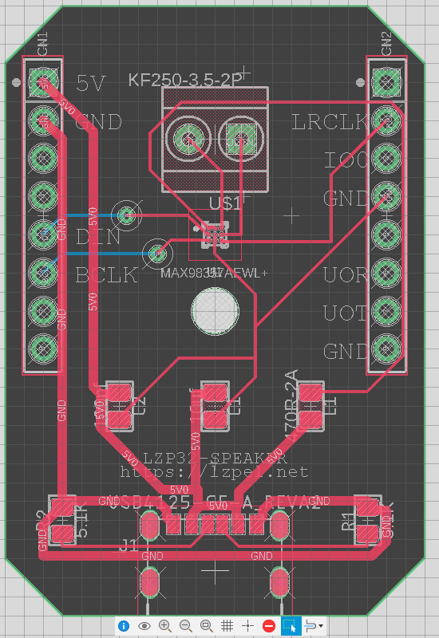
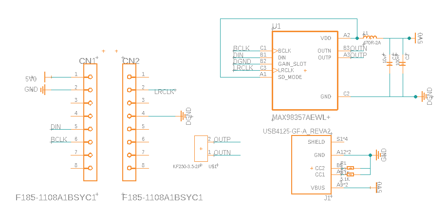

# cloudmama

カメラと音声で生活習慣改善を支援するIoTデバイスとサービス。
一人暮らしの大学生・社会人の生活を監督する目でありたい。

## 紹介動画と紹介記事

[Qiita: ステイホームで乱れた生活習慣を機械学習を使って改善する話 #kuac2020](https://qiita.com/lzpel/items/e25633684128cebec6b8)

[Vimeo: オープンソースハードウェアcloudmamaの紹介](https://vimeo.com/803534490)

## 作り方

1. [3dmodel/package.stl](./3dmodel/package.stl)を3Dプリンターで印刷します
2. [PCB/LZP32-SPEAKER_(最新版)](./PCB)をPCB製造業者（例えばSeeeds Fusion, PCBWAY）などで製造してもらいます。
    - BOMに従い部品も実装してください
3. スピーカー（F02607H0）（[秋月電子](https://akizukidenshi.com/catalog/g/gP-10366/)）を購入してください
    - これでなくとも大抵の8ohmスピーカーに対応しています、別のスピーカーを用いる場合は自分で外装を設計してください。
4. スピーカーの+/-を発注した基盤の+/-にスクリューターミナルを用いて接続してください。
5. USB給電すれば動作します。

## 端末ハードウェア





## 端末ファームウェア

[C++ Source Code](esp32/cloudmama.ino)

## サーバーサービス

音声出力

https://cloudmama.appspot.com/speech

音声出力全パターン

https://cloudmama.appspot.com/speech?all=true

## ESP32 Dev

https://docs.espressif.com/projects/esp-idf/en/stable/esp32/api-guides/tools/idf-docker-image.html?highlight=docker
```shell
docker pull espressif/idf

env MSYS_NO_PATHCONV=1 docker run --rm -v $PWD:/project -w /project espressif/idf idf.py build
# interactive mode
cp -r /opt/esp/idf/examples/get-started/hello_world/* ./
env MSYS_NO_PATHCONV=1 docker run --rm -v $PWD:/project -w /project -it espressif/idf
# 20221229 Docker コンテナからホストのUSBにアクセスできないってマジ？ビルドしてもマイコンに書き込めない。
# ttyUSB0という名前にすると-pを指定せずにflashしても推定してくれる
idf.py -b 921600 flash
```

container内でlsusb -vするとCouldn't open device, some information will be missingとなる
のが関係していると思う。デバイスを開けない

https://learn.microsoft.com/ja-jp/windows/wsl/connect-usb

```shell
usbipd wsl list
usbipd wsl attach --busid <busid>
```

```shell
$ lsusb
Bus 002 Device 001: ID 1d6b:0003 Linux Foundation 3.0 root hub
Bus 001 Device 002: ID 10c4:ea60 Silicon Labs CP210x UART Bridge
Bus 001 Device 001: ID 1d6b:0002 Linux Foundation 2.0 root hub
$ env MSYS_NO_PATHCONV=1 docker run --rm -v $PWD:/project -w /project --device=/dev/bus/usb/001/002:/dev/ttyUSB0 -it espressif/idf
```

Commands which communicate with the development board, such as idf.py flash and idf.py monitor will not work in the container unless the serial port is passed through into the container. However currently this is not possible with Docker for Windows (https://github.com/docker/for-win/issues/1018) and Docker for Mac (https://github.com/docker/for-mac/issues/900).
esp-idf5.0のwindows版
を入れて解決した

## PCB 設計

- screw terminal
  - KF350-3.5-2P
  - DB125-3.5-2P-GN-S
- よく当たる問題と解決法
  - 部品の3Dモデルが反映されない
    - 3Dモデルにstlを使っている->体積を持たないので使えません（警告マークが出ているはずです）STEPファイルを使いましょう
    - STEPファイルを読み込めない->メッシュとしては読み込めません->Teamの一ファイルとしてアップロードし、それを外部コンポーネントとして挿入しましょう（ドラッグアンドドロップ）
    - 3Dモデルが更新されていない->基盤デザインで「ライブラリからデザインを更新」をクリック、「デザインで使用されている全てのライブラリからデザインを更新」ボタンは効果がない->3DPCBにプッシュ

## License
MIT Copyright 2020 lzpel
